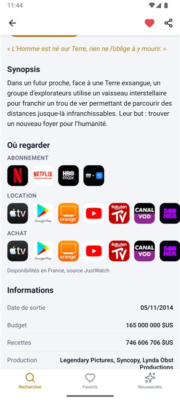
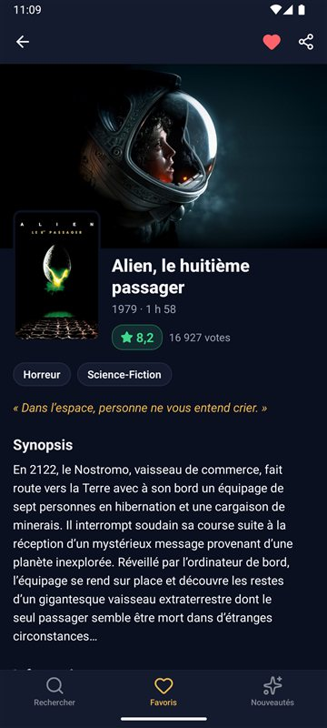
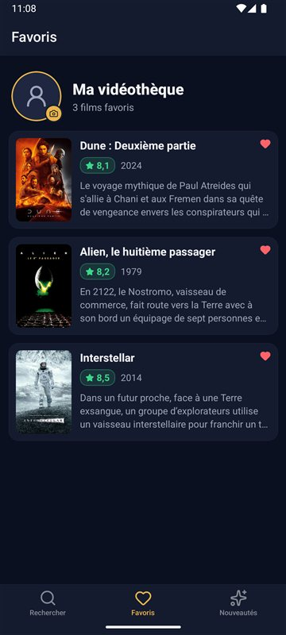

# Movies & Me

Application mobile React Native pour rechercher des films, consulter leur fiche et garder ses favoris, à partir des données de [TMDB](https://www.themoviedb.org/).

<p align="center">
  
  
  
  
</p>
<p align="center">
  
  
  
</p>

## Fonctionnalités

- **Recherche en direct** : les résultats s'affichent pendant la frappe et se chargent au fil du défilement
- **Fiche détaillée** : image de fond, affiche, note, durée, genres, synopsis, budget, recettes et production
- **Bande-annonce** ouverte dans YouTube, en français quand elle existe
- **Où regarder** : les plateformes qui proposent le film en France (abonnement, gratuit, location, achat), données JustWatch
- **Favoris** ajoutés depuis la fiche, conservés d'un lancement à l'autre, dans une vidéothèque avec photo de profil
- **Nouveautés** : les sorties les plus récentes parmi les films ayant reçu au moins 1 000 votes, à rafraîchir en tirant la liste vers le bas
- **Partage** d'un film vers une autre application, avec son lien TMDB
- **Thème clair et sombre**, qui suit le réglage du téléphone
- **États soignés** : blocs de chargement animés, absence de connexion (message et bouton Réessayer), recherche sans résultat, affiche ou résumé manquant

## Stack technique

| Domaine | Choix |
|---|---|
| Framework | React Native 0.83 (New Architecture, Hermes) |
| Interface | Composants fonction et hooks, thèmes clair et sombre, icônes Lucide (react-native-svg) |
| Animations | Reanimated 4 |
| Navigation | React Navigation 7 : onglets et piles d'écrans natives |
| État | Redux (hooks react-redux), persisté avec redux-persist et AsyncStorage |
| Données | API REST de TMDB |
| Tests | Jest et react-test-renderer |
| Autres | react-native-bootsplash (écran de démarrage), react-native-image-picker, moment |

## Lancer le projet

Prérequis : Node.js 20 ou plus, JDK 17 et le SDK Android avec un émulateur ou un téléphone branché (voir [la configuration de l'environnement React Native](https://reactnative.dev/docs/set-up-your-environment)).

```sh
npm install
npm start          # serveur de développement Metro
npm run android    # dans un second terminal : compile, installe et lance l'app
```

L'application a été testée sur Android (émulateur Android 15). La version iOS n'a pas été testée.

## Tests

```sh
npm test
```

Les tests couvrent le démarrage de l'application, la mise en forme des données (dates, durées, notes, montants), le choix de la bande-annonce, le regroupement des plateformes, la pagination sans doublons et le reducer des favoris.

## Structure du projet

```
API/          appels à l'API TMDB
components/   écrans et composants : recherche, fiche, favoris, nouveautés, cartes, états vides…
Helpers/      mise en forme des données, bande-annonce et plateformes
Hooks/        usePaginatedFilms : listes paginées, erreurs et rafraîchissement
Navigation/   onglets et piles d'écrans
Store/        store Redux et reducers
Theme/        thèmes clair et sombre
__tests__/    tests Jest
```

## Outillage

Le dossier `.claude/skills/run-moviesandme` contient un skill [Claude Code](https://claude.com/claude-code) qui lance l'application sur l'émulateur Android et la pilote (recherche, navigation, captures d'écran) pour vérifier chaque modification dans l'app réelle.

## Crédits

Données et images fournies par [TMDB](https://www.themoviedb.org/). Ce produit utilise l'API TMDB mais n'est ni approuvé ni certifié par TMDB.

Réalisé par [@SamirMaoude](https://github.com/SamirMaoude).
